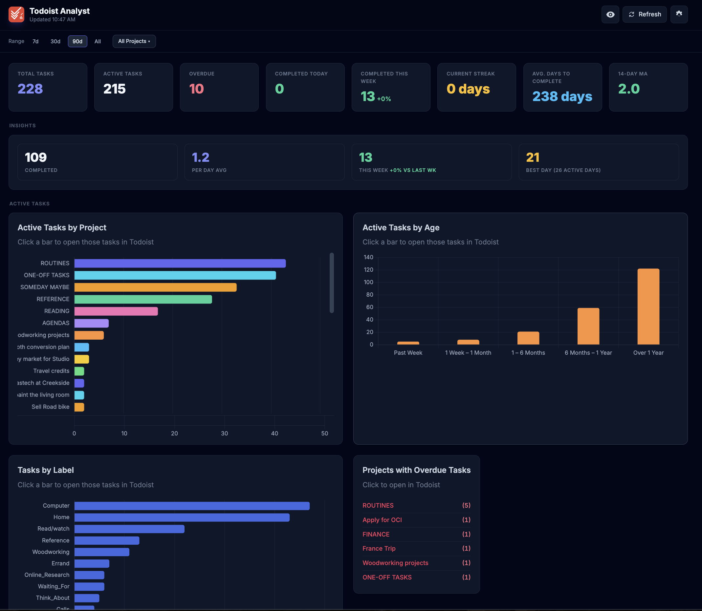

# Todoist Analyst

A personal analytics dashboard for your Todoist data — runs entirely in your
browser, no installation or build step required. It pulls your tasks,
projects, labels, and completion history straight from the Todoist API and
turns them into KPIs, charts, and task lists to help you see where your
attention is needed and where work is piling up.



## Features

### KPIs
- **Total Tasks** — active tasks plus all-time completed count
- **Active Tasks**, **Overdue**, **Completed Today**, **Completed This Week**
- **Current Streak**, **Avg. Days to Complete**, **14-Day moving average**
- Week-over-week comparison badge on the Completed This Week KPI

### Filters
- **Date range picker** — 7d / 30d / 90d / All, applied across all completion charts
- **Project filter** — narrow every tile to one or more projects
- **Section visibility toggle** — show or hide any dashboard section

### Insights
- **Insights Summary** — completed count, per-day average, this week vs. last week, best day

### Active Task Charts
- **Active Tasks by Project** — scrollable horizontal bar, click to open in Todoist
- **Active Tasks by Age** — how long tasks have been sitting unfinished
- **Tasks by Label** — scrollable horizontal bar, click to open in Todoist
- **Projects with Overdue Tasks** — clickable text list, opens overdue filter in Todoist
- **Due in the Next 7 Days** — task list with name, label, project, and due date; overdue shown in red, today in amber
- **Completed Tasks by Project** — scrollable horizontal bar of completions in the selected period

### Completion Charts
- **Completion Trends** — daily completions with optional prior-period overlay
- **Net Task Flow** — tasks created vs. completed each day
- **Completions Over Time** — daily bar chart
- **Completions by Day of Week** — which days you ship the most
- **Weekly Completions** — bar chart scaled to the selected date range

### Health & Recent
- **Backlog Health Score** — 0–100 score based on overdue count, task age, and high-priority tasks without due dates
- **Recently Completed** — scrollable list of the most recently completed tasks
- **Recurring Tasks** — count of recurring habits with overdue, due today, and upcoming breakdown

### Task Lists
- **Tasks Without a Label** — grouped by project; collapses to a compact tile when empty
- **Tasks Without a Project** — list of inbox/unorganised tasks; collapses when empty

### Lead Time
- **Task Lead Time** — histogram of creation-to-completion time across 7 buckets (same day → 3+ months)

### Topics
- **Task Topics word cloud** — most common words in your active task names, sized by frequency

### General
- Click-through deep links on most charts open the matching filtered view in the Todoist web app
- Dark theme, responsive layout
- All data stays on your computer — no backend, no third-party services

## Getting your Todoist API token

1. Open Todoist in your browser.
2. Go to **Settings → Integrations → Developer**.
3. Copy your API token.

## Running the app

```bash
./start.sh
```

This starts a local web server and opens the dashboard at
`http://localhost:8000` in your default browser.

If `./start.sh` doesn't open a browser automatically:

```bash
python3 -m http.server 8000
```

then open `http://localhost:8000` in Brave or Chrome.

## Running it persistently (macOS)

Install a LaunchAgent that starts the server automatically at login:

```bash
./launchd/install.sh
```

The dashboard will be available at `http://localhost:8000` at all times, even
after a reboot — no terminal window needed. To remove it:

```bash
./launchd/uninstall.sh
```

## First-time setup

On first load, click the gear icon and paste in your API token. It is stored
only in this browser's local storage and sent directly to `api.todoist.com`.

## Privacy & security

- Your API token is stored **only** in this browser's local storage, on this computer.
- It is sent directly to `api.todoist.com` — no backend server or third-party service is involved.
- This repository never contains your token or any credentials.

## Tech stack

- Plain HTML / CSS / JS (ES modules) — no build step
- [Tailwind CSS](https://tailwindcss.com/) via the Play CDN
- [Chart.js](https://www.chartjs.org/) for charts
- [wordcloud2.js](https://github.com/timdream/wordcloud2.js) for the word cloud
- [Todoist REST API v1](https://developer.todoist.com/api/v1/)

## License

[MIT](LICENSE) — free to use, modify, and share.
